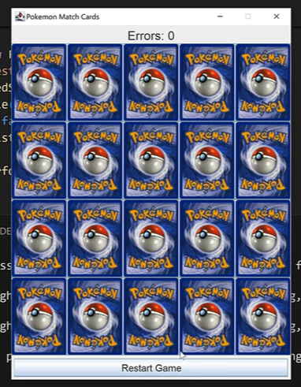
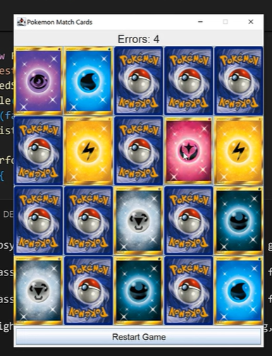
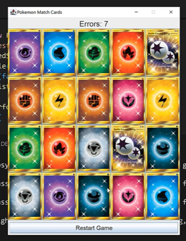

# Pokemon Memory Match

**Flip. Match. Win!** 
A classic **memory card game** with **Pokemon energy types**, built using **Java Swing**.

---

## 🚀 Features

- **4×5 grid** (20 cards, 10 unique types)
- **Error counter** – counts failed matches
- **Restart Game** button
- Cards flip back after **1.5 seconds** if not matched
- Smooth image scaling and clean UI
- Fully playable with mouse

---

## 📸 Screenshots

| All Cards Hidden | Matching in Progress | Errors Counted |
|------------------|------------------------|----------------|
|  |  |  |

---

## Project Structure

```
MemoryCards/
│
│── MemoryCards.java     # Game logic + GUI
│── App.java             # Main entry point
│
├── assets/                     # Required images
│   ├── back.jpg             # Card back
│   ├── darkness.jpg
│   ├── fire.jpg
│   └── ... (10 total)
│
└── README.md
```

> **Important**: Place all 10 energy images + `back.jpg` in the `assets/` folder.

---

## 📦 How to Run

### Using IDE (IntelliJ, Eclipse, VS Code)

1. Open the project
2. Ensure `img/` folder is in the **project root**
3. Run `App.java`

### Terminal

```bash
javac -d bin src/*.java
java -cp bin App
```

> Keep `img/` in the same directory as `bin`.

---

## Game Rules

- Click a card to flip it
- Find **two matching cards** to keep them revealed
- Mismatched cards **flip back after 1.5 seconds**
- **Errors** increase on each failed match
- Click **"Restart Game"** to shuffle and play again

---

## Dependencies

- **Java Swing & AWT** (built-in)
- Image files in `img/`

**No external libraries needed.**

---

## Code Highlights

- Dynamic card loading with `ImageIcon`
- `Timer` for delayed flip-back
- Efficient shuffle using `Math.random()`
- Clean object-oriented design

---

## Author

**Your Name**  
*Java Developer | Game Enthusiast*

---

## License

Free for personal and educational use.

---

**Pokemon Memory Match – How fast can you remember?**
